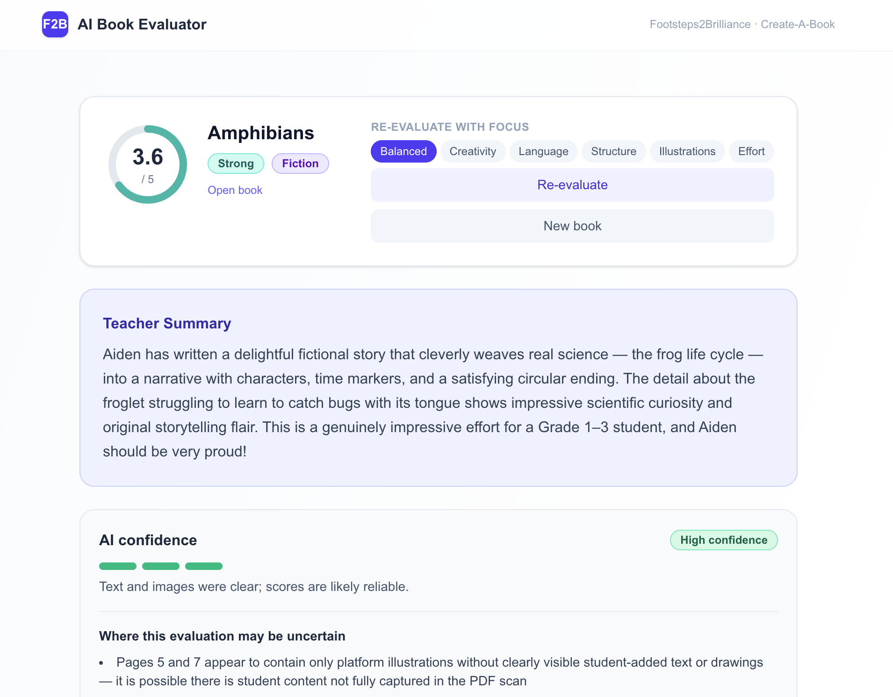
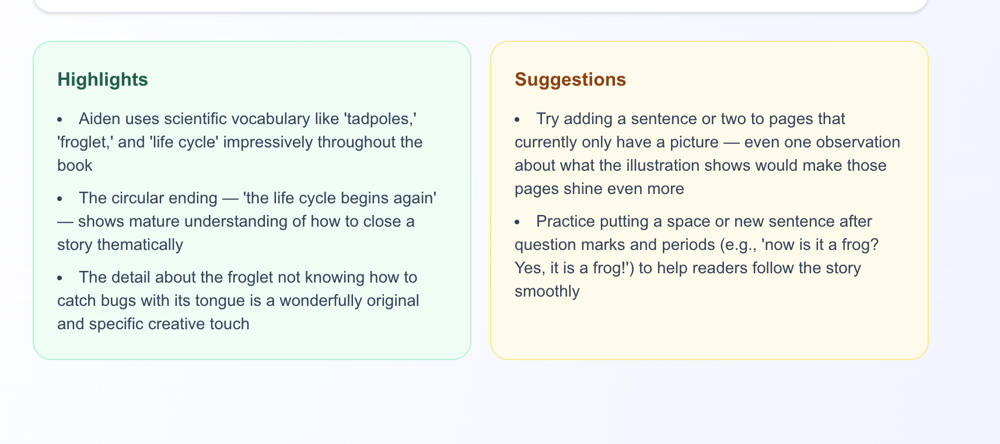
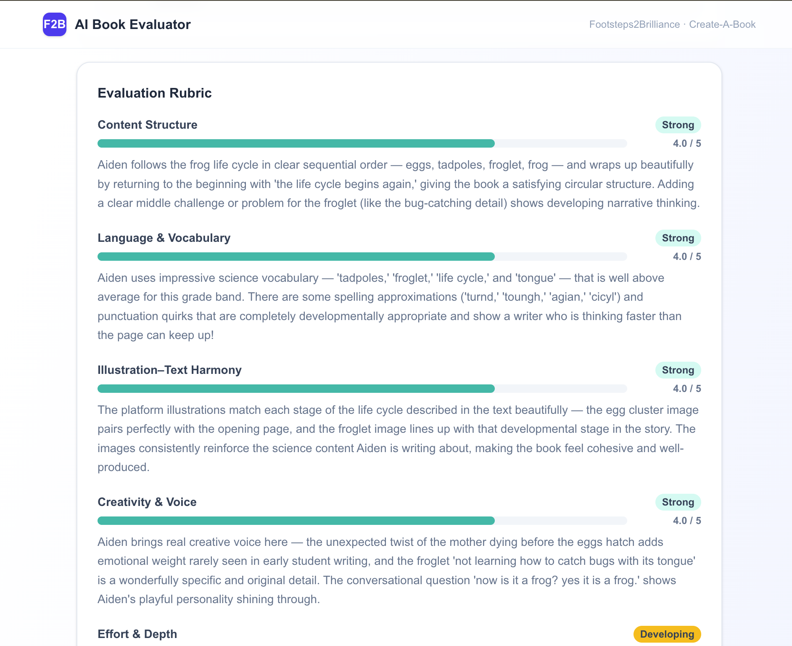
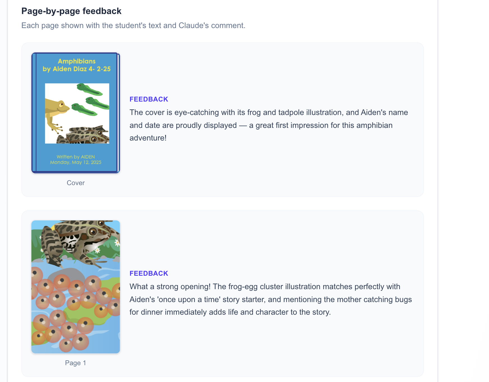

# Footsteps2Brilliance — AI Book Evaluator

A full-stack web app that evaluates student-authored picture books from the Footsteps2Brilliance Create-A-Book platform. Paste a book URL, get a teacher-ready literacy report powered by Claude.

---

## Screenshots

| Evaluation report — score & teacher summary | Highlights & suggestions |
|---|---|
|  |  |

| Evaluation rubric | Page-by-page feedback |
|---|---|
|  |  |

---

## Approach

### Model choice — Claude Sonnet 4.6

The app uses **Claude Sonnet 4.6** (`claude-sonnet-4-6`) as the default evaluation model.

I initially tried cheaper models (Haiku and earlier Sonnet variants) to keep costs low, but the quality of feedback dropped noticeably — rubric scores were less calibrated, per-page feedback was generic, and the model struggled to correctly identify genres and distinguish blank from low-effort pages. Sonnet 4.6 produced consistently warm, specific, teacher-ready feedback, which is the core value of the product, so it was the clear choice despite higher cost.

The model can be overridden at runtime via the `ANTHROPIC_MODEL` environment variable.

### Book scraping — plain HTML fetch instead of Playwright

My first instinct was to use **Playwright** to load the book pages in a headless browser, since the books are interactive React apps. However, exploring the print URL (`/print`) revealed that the entire page structure — page images, student text in `<iframe srcdoc>` elements, and print form fields — is rendered in plain server-side HTML.

This meant a simple `fetch()` call was enough to get all the data. No Playwright, no browser overhead, no extra dependency. The scraper:

1. Fetches `<book-url>/print`
2. Extracts `page_positions[]` form fields to reconstruct the print PDF URL
3. Parses `` tags for page images (cover, interior pages, back cover)
4. Extracts student text from `<iframe class="page_xml" srcdoc="...">` elements per page
5. Detects orientation (portrait vs landscape) from inline styles

This approach is significantly cheaper and faster than a headless browser.

### Evaluation criteria

Each book is evaluated on five rubric dimensions, scored 1–5 relative to typical Grade 1–3 work:

| Dimension | What is scored |
|---|---|
| **Content Structure** | Story arc (fiction), logical organization (non-fiction), clarity of steps (instructional), or sequencing (personal narrative) |
| **Language & Vocabulary** | Word choice, sentence variety, grade-appropriate spelling — developmental spelling is scored generously |
| **Illustration–Text Harmony** | How well student drawings and written text reinforce each other |
| **Creativity & Voice** | Originality, personality, unexpected details, distinctive perspective |
| **Effort & Depth** | How deeply the student engaged — page count, idea development, completeness |

Genre is detected first (Fiction / Non-fiction / Instructional / Personal Narrative / Other) and the rubric is calibrated accordingly — a non-fiction book is not penalized for lacking a story arc.

The evaluation also produces:
- An overall score and grade (Exceptional / Strong / Developing / Emerging)
- A teacher summary (2–3 warm sentences)
- Highlights and suggestions
- Per-page feedback with image previews
- A confidence rating (high / medium / low) with specific caveats

Users can re-evaluate a book with a different **focus** (Creativity, Language, Structure, Illustrations, Effort, or Balanced) to get a report that emphasises a specific dimension.

---

## Running with Docker

### Prerequisites

- Docker and Docker Compose installed
- An Anthropic API key

### 1. Configure environment variables

Copy the example env file and fill in your values:

```bash
cp backend/.env.example backend/.env
```

Edit `backend/.env`:

```env
# Required
ANTHROPIC_API_KEY=sk-ant-api03-...

# Optional — defaults shown
ANTHROPIC_MODEL=claude-sonnet-4-6
PORT=3001
CORS_ORIGIN=http://localhost:3000
REDIS_URL=redis://localhost:6379   # set automatically by Docker Compose
CACHE_TTL_SECONDS=604800           # 7 days
```

The frontend reads one variable at **build time** (baked into the Next.js bundle). If you need a non-default API URL, set it before building:

```env
# frontend/.env.local (only needed if backend is not on localhost:3001)
NEXT_PUBLIC_API_URL=http://localhost:3001
```

### 2. Build and start

```bash
# First time, or after any code changes:
docker-compose up -d --build

# Subsequent starts with no code changes:
docker-compose up -d
```

This starts three services:

| Service | Port | Description |
|---|---|---|
| `backend` | 3001 | NestJS API |
| `frontend` | 3000 | Next.js UI |
| `redis` | 6379 | Evaluation result cache |

### 3. Open the app

Visit [http://localhost:3000](http://localhost:3000), paste a `https://myf2b.com/cab2s/<id>` URL, and click **Evaluate**.

### Stopping

```bash
docker-compose down
```

---

## Running locally (without Docker)

```bash
# Terminal 1 — backend
cd backend
cp .env.example .env   # fill in ANTHROPIC_API_KEY
npm install
npm run start:dev

# Terminal 2 — frontend
cd frontend
npm install
npm run dev
```

---

## What I would improve with more time

### Caching for focus re-evaluations

Currently, Redis caches the result of a full evaluation keyed by book URL. When a user switches focus (e.g. from Balanced to Creativity), the app re-calls Claude with a different prompt, incurring extra latency and cost. With more time I would cache each `(url, focus)` combination independently so that switching between previously-seen focuses is instant and free.

### Batch processing — multiple books in one run

The UI currently handles one book at a time. A useful upgrade would be a bulk mode where a teacher can paste a list of book URLs (or upload a CSV) and receive a consolidated report for the whole class in a single run. The backend would process books in parallel with a concurrency limit to avoid hitting Anthropic rate caps.

### Deployed app

The app only runs locally at the moment. I would deploy it to a cloud provider (e.g. Railway or Render for the NestJS backend + Redis, and Vercel for the Next.js frontend) so it is accessible without any local setup, and add a public URL to this README.

